 

## About

I'm a software engineering student at [1337 (42 Network)](https://1337.ma) in Khouribga, Morocco, graduating in 2026. My background is systems programming: I've written an HTTP server and a shell from scratch in C and C++. On top of that I build full-stack products in TypeScript and automate business processes with n8n.

I'm taking on remote and freelance work in two areas:

| Full-stack development | n8n automation |
| --- | --- |
| REST APIs, real-time features with WebSockets, authentication, PostgreSQL schemas, and the interface on top. | Connecting tools through webhooks and APIs, removing manual steps, and building workflows that are easy to hand over and maintain. |

## Selected work

### [Hirefy](https://github.com/ibrahimesseddyq/ft_transcendance)
A team-built recruitment platform with real-time notifications, OAuth2 sign-in, and role-based application flows, split into multiple services.

  

### [inception](https://github.com/soufianeessarhir/inception)
A containerized web stack on Alpine Linux: NGINX with TLS in front, MariaDB on a persistent volume, services on isolated Docker networks, all defined in Docker Compose.

   

### [httpserver](https://github.com/soufianeessarhir/httpserver)
An HTTP/1.1 server in C++98 with non-blocking I/O (`epoll` / `kqueue`), request parsing, CGI, and virtual hosts. Handled 1,000+ concurrent connections in Siege benchmarks.

  

### [minishell](https://github.com/soufianeessarhir/minishell)
A Bash-like shell in C with pipes, redirections, variable expansion, signal handling, and built-in commands.

  

### [XAD](https://github.com/auto-differentiation/xad)
Contributor at the XAD Hackathon 2024 (UM6P, Benguerir), working on an automatic differentiation library for C++.

## Stack

| | |
| --- | --- |
| **Languages** | TypeScript, JavaScript, C, C++, Python, Bash |
| **Backend** | Node.js, Express, NestJS, FastAPI, REST, WebSockets, OAuth2 |
| **Automation** | n8n, webhooks, API integrations |
| **Data** | PostgreSQL, MariaDB, Prisma |
| **Infrastructure** | Docker, Docker Compose, NGINX, CI/CD, Linux |
| **Systems** | POSIX, sockets, IPC, threads, epoll, kqueue |
| **Tooling** | Git, GitHub, CMake, Make |

## Education and languages

- **1337 (42 Network), Khouribga**: Software Engineering, 2023–2026
- **Frontend Masters**: JavaScript, Node.js, and server fundamentals
- **n8n**: Essentials, Integrations, and In Practice courses
- **Languages**: Arabic (native), English (B2), French (B1)

## Work with me

Have a product to build or a process to automate?

Morocco · Remote · Freelance

